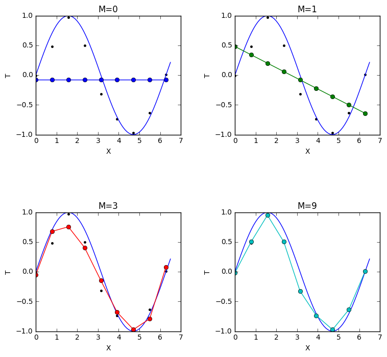

# Machine Learning 1 

[](LICENSE)

## Description

Code for the [Machine Learning 1](http://studiegids.uva.nl/xmlpages/page/2017-2018-en/search-course/course/31203) course of the MSc in Artificial Intelligence at the University of Amsterdam.

### Lab 1 - Linear Regression and Overfitting

<p align="justify">
Polynomial Regression, Tikhonov Regularization, k-fold cross validation, Bayesian linear regression</p>

- [Assignment and Solutions](lab1/lab01_KIANFAR_MIRONENCO.ipynb)

<p align="center">
  <br />
  <i>Polynomial Regression</i>
</p>

### Lab 2 - Classification

<p align="justify">
Multi-class logistic regression with stochatic gradient descent, Multi-layer perceptrons, MAP optimization, </p>

- [Assignment and Solutions](lab2/lab02_KIANFAR_MIRONENCO.ipynb)

<p align="center">
  <br />
  <i>MNIST Learned weights</i>
</p>

### Lab 3 - Gaussian Process Regression
<p align="justify">
Gaussian processes, sampling, predictive distribution, hyperparameter learning
</p>

- [Assignment and Solutions](lab3/lab03_KIANFAR_MIRONENCO.ipynb)

<p align="center">
  <br />
  <i>Gaussian Process Regression</i>
</p>

## Testing
Refer to each lab and run the iPython notebook as follows.
```bash
jupyter notebook $notebook_name$.ipynb
```
## Dependencies

Python 2.7: Matplotlib, NumPy, SciPy, gzip, cPickle

## Contributors

- [Dana Kianfar](https://github.com/danakianfar)
- [Mircea Mironenco](https://github.com/mirceamironenco)

## Copyright

Copyright © 2017 Dana Kianfar and Mircea Mironenco.

<p align="justify">
This project is distributed under the <a href="LICENSE">MIT license</a>. Please review the <a href="http://student.uva.nl/en/content/az/plagiarism-and-fraud/plagiarism-and-fraud.html">UvA regulations governing Fraud and Plagiarism</a> in case you are a student at the UvA.
</p>